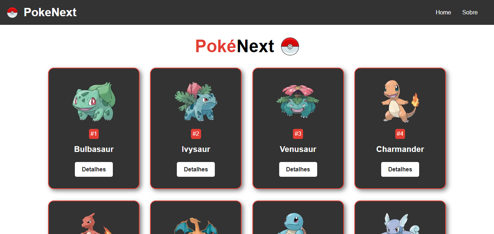
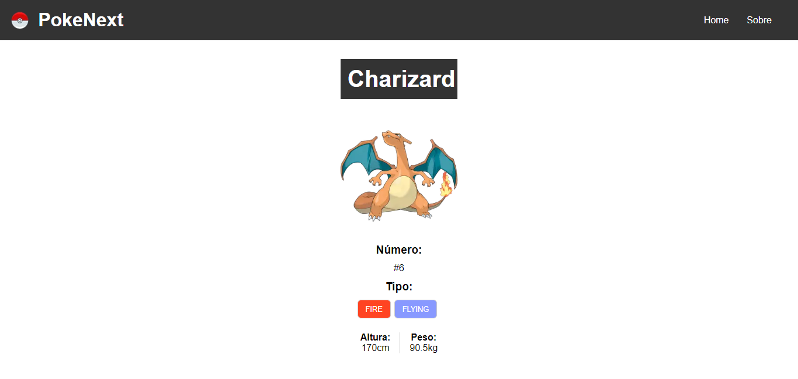

# PokéNext

## Uma Pokedex utilizando a PokeAPI

Projeto feito para praticar Next.JS desenvolvimento no curso de Next.JS do Professor Matheus Basttisti  
[Link do curso](https://www.youtube.com/playlist?list=PLnDvRpP8BnezfJcfiClWskFOLODeqI_Ft)  
[Deploy](https://pokenextt.netlify.app)

### Home

### Detalhe do Pokémon

